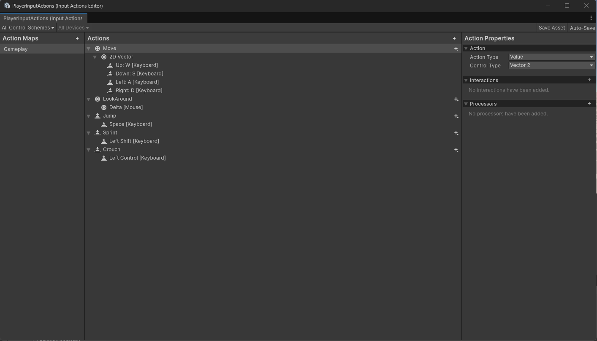
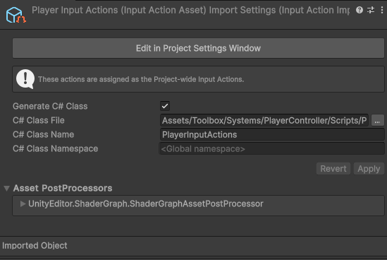
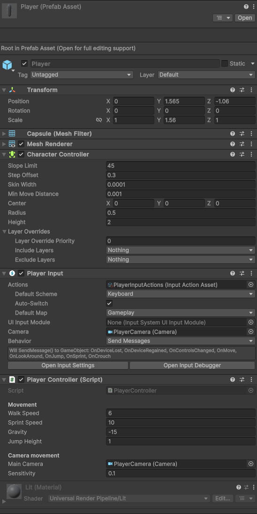

# Player Controller (First person)

Système qui permet de faire bouger le joueur.

Utilisation d'un character controller et du "nouveau" Unity input system

## Utilisation
- Move: WASD
- Look around: Mouse
- Jump: Space
- Crouch: Left Ctrl
- Sprint: Left Shift

## Configuration
1. Créer/copier le script `PlayerController` et le input actions `PlayerInputActions`
2. Ajouter les components suivants au Player: Character controller, Player Input et le script PlayerController
3. Si pas déjà fait, ajouter la main caméra comme enfant du Player
4. Si besoin ajouter les actions dans le `PlayerInputActions` comme ceci 
5. Ne pas oublier de générer le script associé au `PlayerInputActions` 

## Résultat final
L'inspector devrait ressembler de ça 

